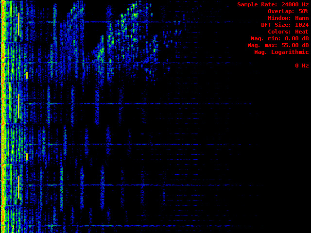
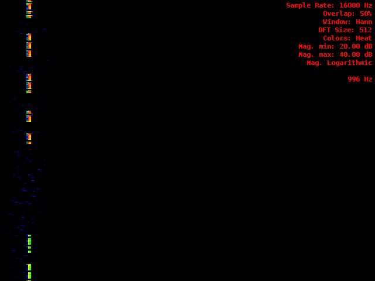
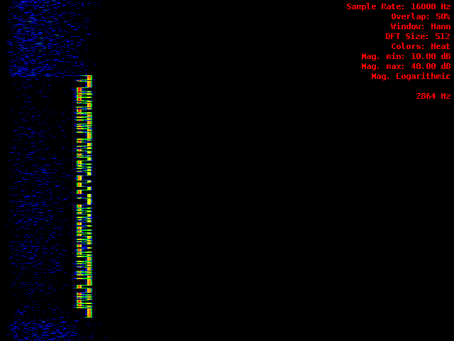
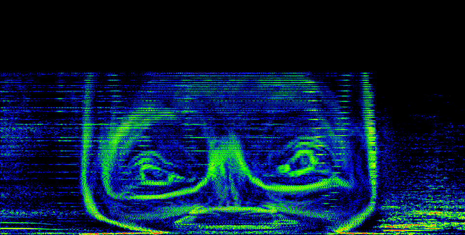

# audioprism [](https://travis-ci.org/vsergeev/audioprism) [](https://github.com/vsergeev/audioprism) [](https://github.com/vsergeev/audioprism/blob/master/LICENSE)

audioprism is a spectrogram tool for PulseAudio and WAV files.

## Examples

**Music**




**CW/Morse**



**RTTY**



**A segment of Aphex Twin's equation song**

```
$ sox Aphex\ Twin\ -\ Equation.mp3 equation_segment.wav remix 1,2 trim 5:26.5 11
$ ./audioprism --orientation horizontal equation_segment.wav equation_spectrogram.png
```



## Usage

```
$ audioprism
```

In real-time mode, audioprism renders the spectrogram of PulseAudio audio input to an SDL window in real-time. The `pavucontrol` mixer can be used to select the audio input source for audioprism. PulseAudio provides "monitors" of audio output devices as audio input sources, so audioprism can also be used to render the spectrogram of audio playing to an output device.

```
$ audioprism test.wav test.png
```

In WAV file mode, audioprism renders the spectrogram of a single channel WAV input file to an image output file. The audio input file must be a single channel WAV file. The image output file can be any kind of image format supported by [GraphicsMagick](http://www.graphicsmagick.org/), determined by its file extension.


```
$ audioprism --help
Real-time Usage: ./audioprism [options]
 WAV File Usage: ./audioprism [options] <WAV file input> <image file output>

Interface Settings
    -h,--help                   Help
    --width <width>             Width of spectrogram (default 640)
    --height <height>           Height of spectrogram (default 480)
    --orientation <orientation> Orientation [horizontal, vertical]
                                    (default vertical)

Audio Settings
    -r,--sample-rate <rate>     Audio input sample rate (default 24000)

DFT Settings
    --overlap <percentage>      Samples overlap percentage (default 50)
    --dft-size <size>           DFT Size, must be power of two (default 1024)
    --window <window function>  Window Function [hann, hamming, bartlett, rectangular]
                                  (default hann)

Spectrogram Settings
    --magnitude-scale <scale>   Magnitude Scale [linear, logarithmic]
                                    (default logarithmic)
    --magnitude-min <value>     Magnitude Minimum (default 0.0)
    --magnitude-max <value>     Magnitude Maximum (default 50.0)
    --colors <color scheme>     Color Scheme [heat, blue, grayscale]
                                    (default heat)

Interactive Keyboard Control:
    q           - Quit
    h           - Hide/show settings information
    d           - Hide/show debug statistics
    c           - Cycle color scheme
    w           - Cycle window function
    l           - Toggle logarithmic/linear magnitude

    -           - Decrease minimum magnitude
    =           - Increase minimum magnitude

    [           - Decrease maximum magnitude
    ]           - Increase maximum magnitude

    Left arrow  - Decrease DFT Size
    Right arrow - Increase DFT Size

    Down arrow  - Decrease overlap
    Up arrow    - Increase overlap

audioprism v1.0.1 - https://github.com/vsergeev/audioprism
$
```

## Building

Arch Linux users can install the AUR package `audioprism`.

audioprism depends on: [PulseAudio](http://www.freedesktop.org/wiki/Software/PulseAudio/), [FFTW3](http://www.fftw.org/), [SDL2](http://libsdl.org/), [SDL2_ttf](https://www.libsdl.org/projects/SDL_ttf/), [libsndfile](http://www.mega-nerd.com/libsndfile/), [GraphicsMagick](http://www.graphicsmagick.org/), and a C++11 compiler.

```
# Ubuntu/Debian
sudo apt-get install libpulse-dev libfftw3-dev libsdl2-dev libsdl2-ttf-dev libsndfile1-dev libgraphicsmagick++1-dev

# Fedora/RedHat
sudo yum install pulseaudio-libs-devel fftw-devel SDL2-devel SDL2_ttf-devel libsndfile-devel GraphicsMagick-c++-devel

# ArchLinux
sudo pacman -S libpulse fftw sdl2 sdl2_ttf libsndfile graphicsmagick
```

```
git clone https://github.com/vsergeev/audioprism.git
cd audioprism
make
sudo make install
```

## License

audioprism is GPLv3 licensed. See the included `LICENSE` file for more details.

