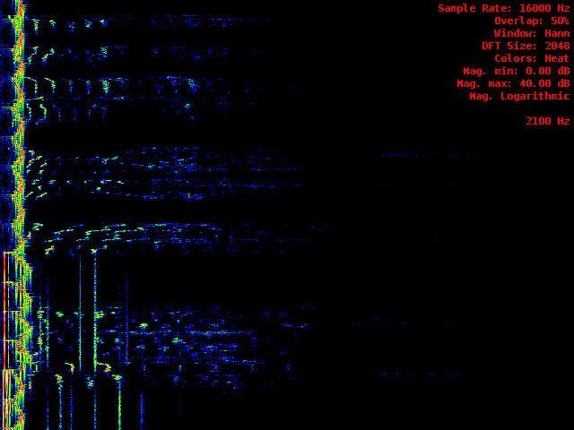

# audioprism

audioprism is a real-time spectrogram tool for PulseAudio and a command-line spectrogram tool for WAV files.

## Examples

**Music**




**CW/Morse**


**RTTY**


**A segment of Aphex Twin's equation song**

```
$ sox Aphex\ Twin\ -\ Equation.mp3 equation_segment.wav remix 1,2 trim 5:26.5 11
$ ./audioprism --orientation horizontal equation_segment.wav equation_spectrogram.png
```


## Usage

### Real-time Mode

```
$ audioprism
```

In real-time mode, audioprism renders the spectrogram of PulseAudio audio input to an SDL window in real-time. The common [pavucontrol](http://freedesktop.org/software/pulseaudio/pavucontrol/) volume control tool can be used to select the audio input source for audioprism. PulseAudio provides "monitors" of audio output devices as audio input sources, so audioprism can also be used to render the spectrogram of audio playing to an output device.

Many settings, like window overlap, DFT size, magnitude ranges, and color scheme can be configured interactively with the keyboard controls documented [below](#full-usage), or by command-line options. Certain settings — window dimensions, orientation, and audio sample rate — can only be configured with command-line options.

### File Mode

```
$ audioprism test.wav test.png
```

In file mode, audioprism renders the spectrogram of a single channel WAV input file to an image output file. The audio input file must be a single channel WAV file. The image output file may be any kind of image format supported by [GraphicsMagick](http://www.graphicsmagick.org/), determined by its file extension.

All settings used to render the spectrogram are configurable by command-line — see program usage [below](#full-usage) for more information. The height, if vertical orientation is selected, or width, if a horizontal orientation is selected, of the resulting image will depend on the audio length and the samples overlap percentage. The audio sample rate is determined by the audio file and is not configurable.

### Full usage

```
$ audioprism --help
 Real-time Usage: ./audioprism [options]
Audio File Usage: ./audioprism [options] <audio file input> <image file output>

Interface Settings
    -h,--help                   Help
    --width <width>             Width of spectrogram (default 640)
    --height <height>           Height of spectrogram (default 480)
    --orientation <orientation> Orientation [horizontal, vertical]
                                    (default vertical)

Audio Settings
    -r,--sample-rate <rate>     Audio input sample rate (default 24000)

DFT Settings
    --overlap <percentage>      Samples overlap percentage (default 50)
    --dft-size <size>           DFT Size, must be power of two (default 1024)
    --window <window function>  Window Function [hann, hamming, bartlett, rectangular]
                                  (default hann)

Spectrogram Settings
    --magnitude-scale <scale>   Magnitude Scale [linear, logarithmic]
                                    (default logarithmic)
    --magnitude-min <value>     Magnitude Minimum (default 0.0)
    --magnitude-max <value>     Magnitude Maximum (default 50.0)
    --colors <color scheme>     Color Scheme [heat, blue, grayscale]
                                    (default heat)

Interactive Keyboard Control:
    q           - Quit
    h           - Hide/show settings information
    d           - Hide/show debug statistics
    c           - Cycle color scheme
    w           - Cycle window function
    l           - Toggle logarithmic/linear magnitude

    -           - Decrease minimum magnitude
    =           - Increase minimum magnitude

    [           - Decrease maximum magnitude
    ]           - Increase maximum magnitude

    Left arrow  - Decrease DFT Size
    Right arrow - Increase DFT Size

    Down arrow  - Decrease overlap
    Up arrow    - Increase overlap

audioprism v1.0 - https://github.com/vsergeev/audioprism
$
```

## Building

audioprism depends on: [PulseAudio](http://www.freedesktop.org/wiki/Software/PulseAudio/), [FFTW3](http://www.fftw.org/), [SDL2](http://libsdl.org/), [SDL2_ttf](https://www.libsdl.org/projects/SDL_ttf/), [libsndfile](http://www.mega-nerd.com/libsndfile/), [GraphicsMagick](http://www.graphicsmagick.org/), and a C++11 compiler.

```
# Ubuntu/Debian
$ sudo apt-get install libpulse-dev libfftw3-dev libsdl2-dev libsdl2-ttf-dev libsndfile1-dev libgraphicsmagick++1-dev

# Fedora/RedHat
$ sudo yum install pulseaudio-libs-devel fftw-devel SDL2-devel SDL2_ttf-devel libsndfile-devel GraphicsMagick-c++-devel

# ArchLinux
$ sudo pacman -S pulseaudio fftw sdl2 sdl2_ttf libsndfile graphicsmagick

$ git clone https://github.com/vsergeev/audioprism.git
$ make
rm -rf build
rm -rf audioprism
g++ -std=c++11 -W -Wall -Wextra -Wconversion -pedantic -O3 -g -Isrc/ -I/usr/include/SDL2 -D_REENTRANT -I/usr/include/GraphicsMagick -c src/audio/PulseAudioSource.cpp -o build/src/audio/PulseAudioSource.o
g++ -std=c++11 -W -Wall -Wextra -Wconversion -pedantic -O3 -g -Isrc/ -I/usr/include/SDL2 -D_REENTRANT -I/usr/include/GraphicsMagick -c src/audio/WaveAudioSource.cpp -o build/src/audio/WaveAudioSource.o
g++ -std=c++11 -W -Wall -Wextra -Wconversion -pedantic -O3 -g -Isrc/ -I/usr/include/SDL2 -D_REENTRANT -I/usr/include/GraphicsMagick -c src/dft/RealDft.cpp -o build/src/dft/RealDft.o
g++ -std=c++11 -W -Wall -Wextra -Wconversion -pedantic -O3 -g -Isrc/ -I/usr/include/SDL2 -D_REENTRANT -I/usr/include/GraphicsMagick -c src/image/MagickImageSink.cpp -o build/src/image/MagickImageSink.o
g++ -std=c++11 -W -Wall -Wextra -Wconversion -pedantic -O3 -g -Isrc/ -I/usr/include/SDL2 -D_REENTRANT -I/usr/include/GraphicsMagick -c src/spectrogram/SpectrumRenderer.cpp -o build/src/spectrogram/SpectrumRenderer.o
g++ -std=c++11 -W -Wall -Wextra -Wconversion -pedantic -O3 -g -Isrc/ -I/usr/include/SDL2 -D_REENTRANT -I/usr/include/GraphicsMagick -c src/main/AudioThread.cpp -o build/src/main/AudioThread.o
g++ -std=c++11 -W -Wall -Wextra -Wconversion -pedantic -O3 -g -Isrc/ -I/usr/include/SDL2 -D_REENTRANT -I/usr/include/GraphicsMagick -c src/main/SpectrogramThread.cpp -o build/src/main/SpectrogramThread.o
g++ -std=c++11 -W -Wall -Wextra -Wconversion -pedantic -O3 -g -Isrc/ -I/usr/include/SDL2 -D_REENTRANT -I/usr/include/GraphicsMagick -c src/main/InterfaceThread.cpp -o build/src/main/InterfaceThread.o
g++ -std=c++11 -W -Wall -Wextra -Wconversion -pedantic -O3 -g -Isrc/ -I/usr/include/SDL2 -D_REENTRANT -I/usr/include/GraphicsMagick -c src/main/main.cpp -o build/src/main/main.o
g++ build/src/audio/PulseAudioSource.o build/src/audio/WaveAudioSource.o build/src/dft/RealDft.o build/src/image/MagickImageSink.o build/src/spectrogram/SpectrumRenderer.o build/src/main/AudioThread.o build/src/main/SpectrogramThread.o build/src/main/InterfaceThread.o build/src/main/main.o -o audioprism -L/usr/lib -lSDL2 -lpthread -lSDL2_ttf -lpulse -lpulse-simple -lfftw3 -lsndfile -lGraphicsMagick++ -lGraphicsMagick -llcms2 -lfreetype -lXext -lSM -lICE -lX11 -llzma -lbz2 -lz -lltdl -lm -lgomp -lpthread
$ make install
```

## Issues

Feel free to report any issues, bug reports, or suggestions at github or by email at vsergeev at gmail.

## License

audioprism is MIT licensed. See the included `LICENSE` file for more details.

